# GraphRAG Finance — Architecture

> Full system architecture for the TigerGraph GraphRAG Inference Hackathon project.  
> Open `architecture.excalidraw` at [excalidraw.com](https://excalidraw.com) to edit the live diagram.

---

## Architecture Diagram

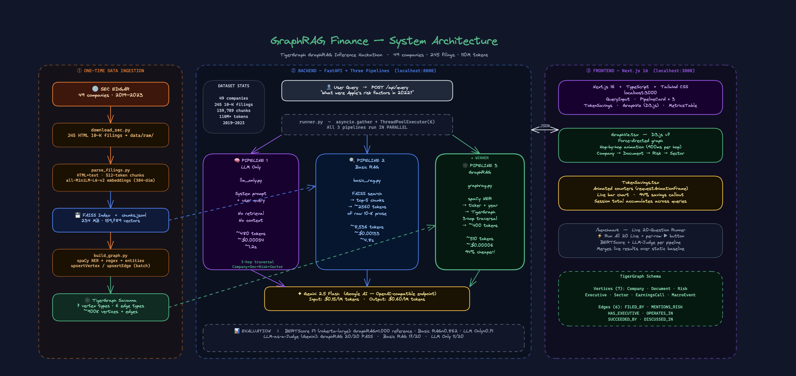

> **Three regions:** ① Data Ingestion (orange) — ② Backend Pipelines (blue) — ③ Frontend (purple)  
> **Token savings:** GraphRAG averages ~1,690 tokens vs ~8,291 for Basic RAG = **79% reduction** (and the highest BERTScore of the three)

---

## Table of Contents

1. [System Overview](#1-system-overview)
2. [Three-Pipeline Architecture](#2-three-pipeline-architecture)
3. [Data Ingestion Pipeline](#3-data-ingestion-pipeline)
4. [TigerGraph Knowledge Graph Schema](#4-tigergraph-knowledge-graph-schema)
5. [Multi-Hop Graph Traversal](#5-multi-hop-graph-traversal)
6. [API Request Flow](#6-api-request-flow)
7. [Frontend Component Tree](#7-frontend-component-tree)
8. [Evaluation Pipeline](#8-evaluation-pipeline)
9. [Token Economics](#9-token-economics)
10. [Deployment Architecture](#10-deployment-architecture)

---

## 1. System Overview

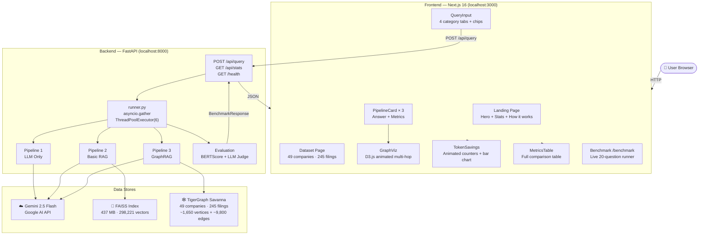

---

## 2. Three-Pipeline Architecture

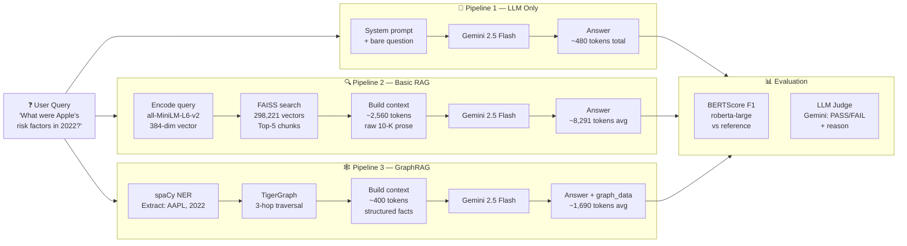

---

## 3. Data Ingestion Pipeline

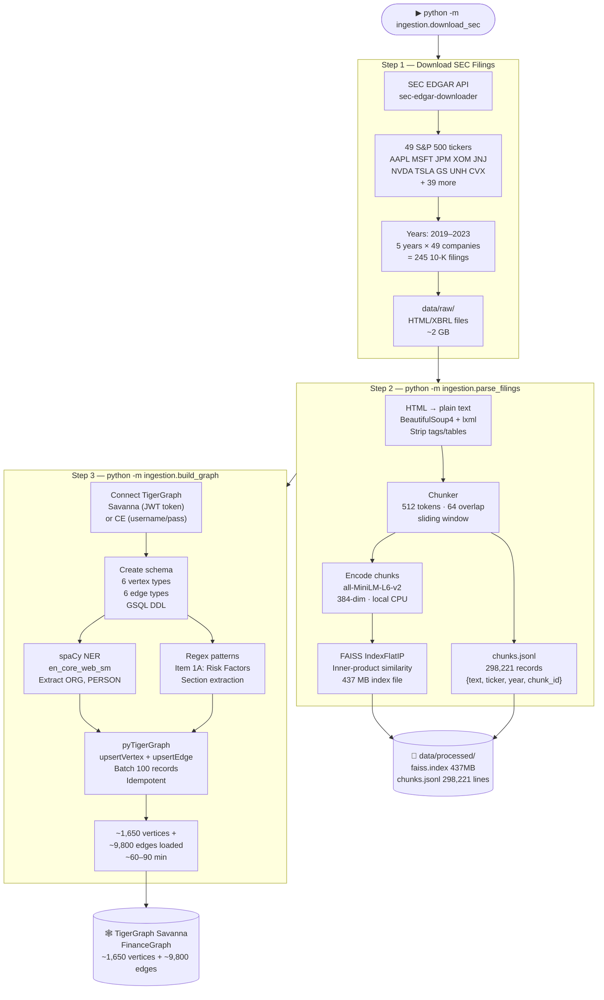

---

## 4. TigerGraph Knowledge Graph Schema

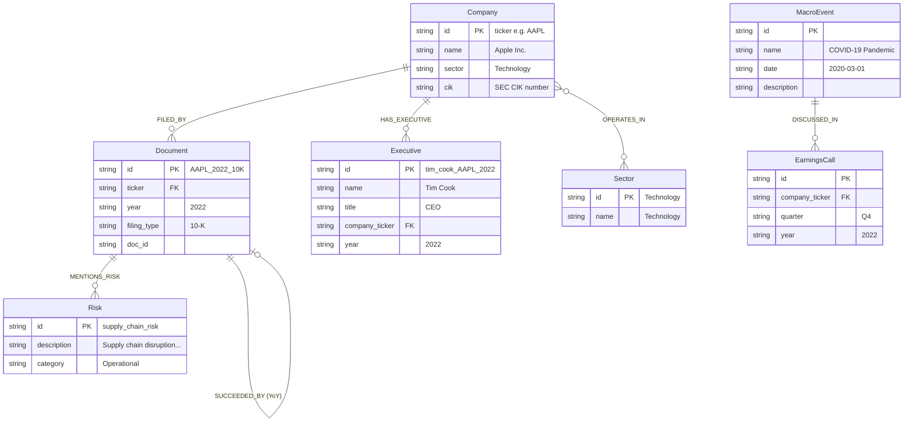

### Edge Types Detail

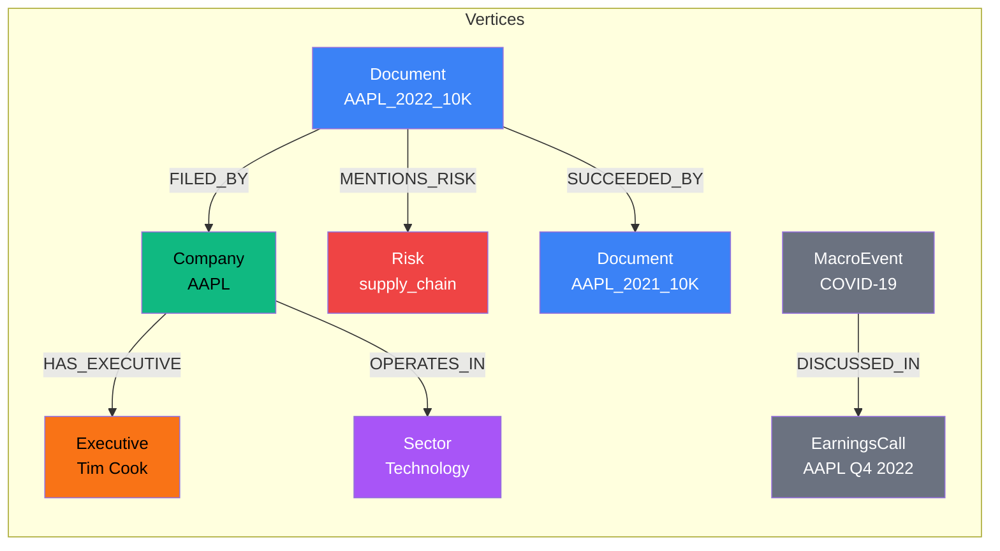

---

## 5. Multi-Hop Graph Traversal

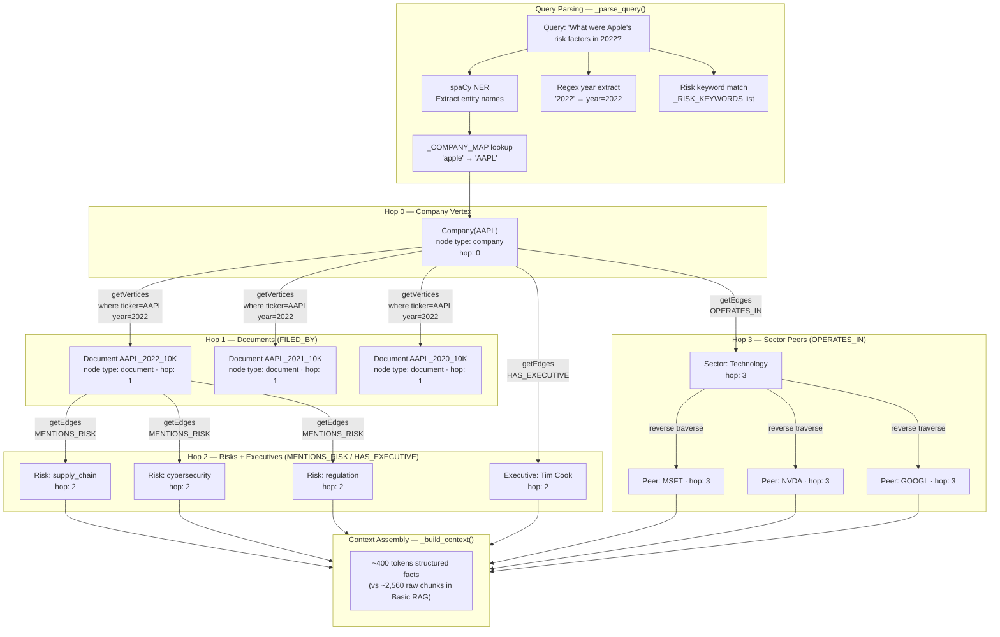

### Cross-Company Query Path (no ticker)

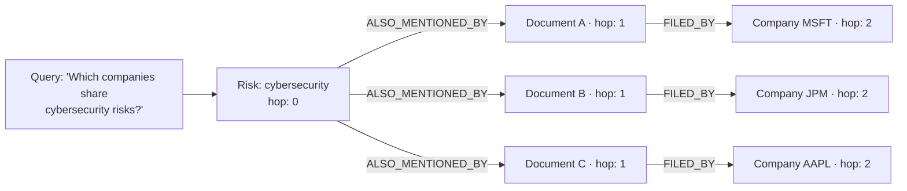

---

## 6. API Request Flow

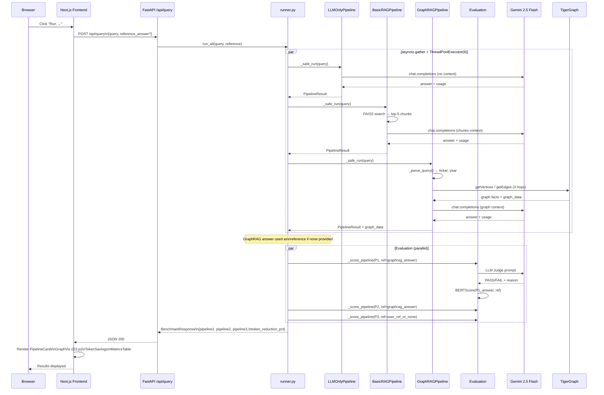

---

## 7. Frontend Component Tree

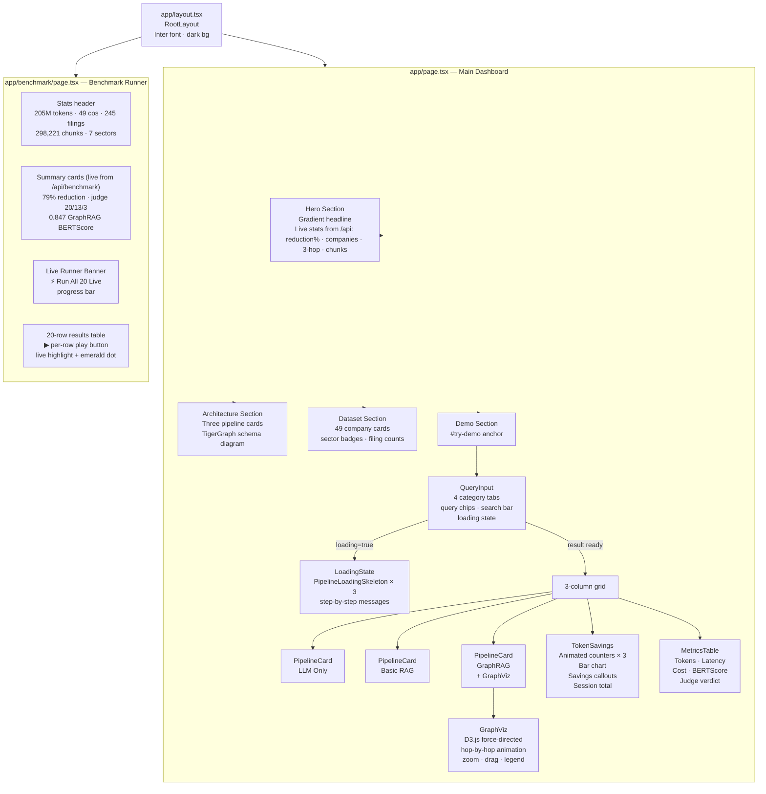

---

## 8. Evaluation Pipeline

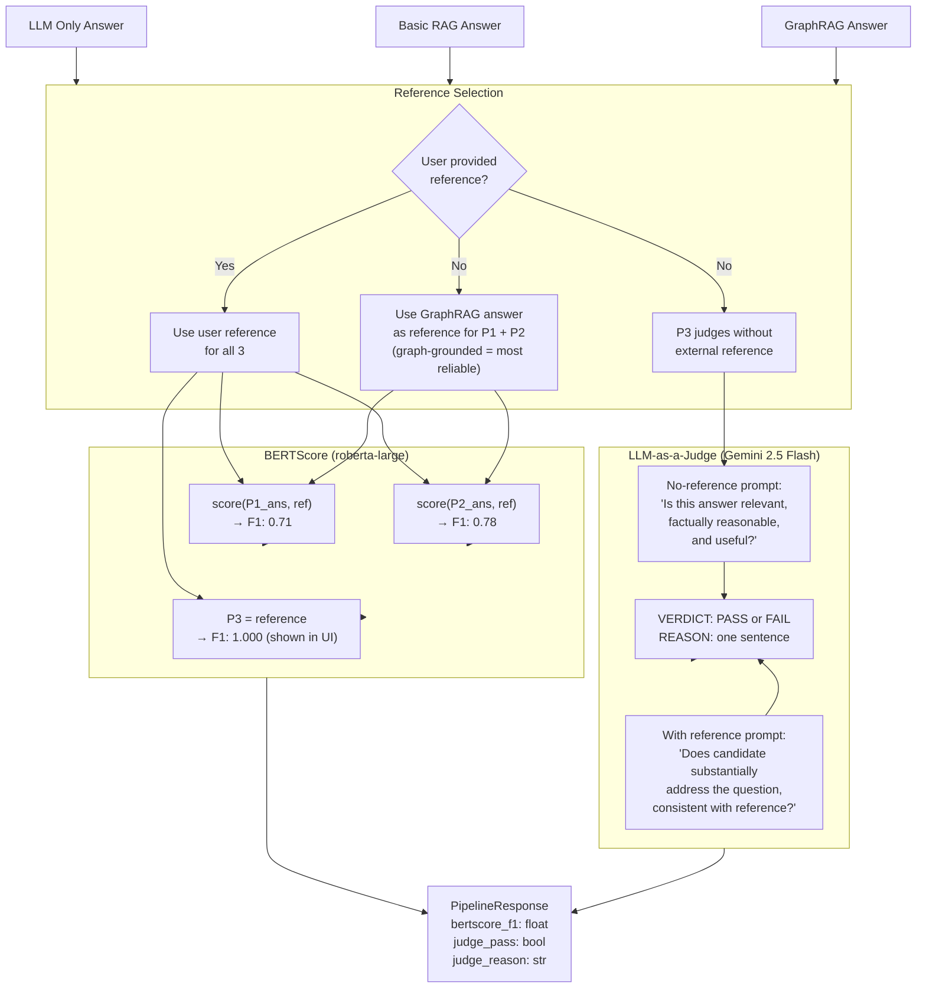

---

## 9. Token Economics

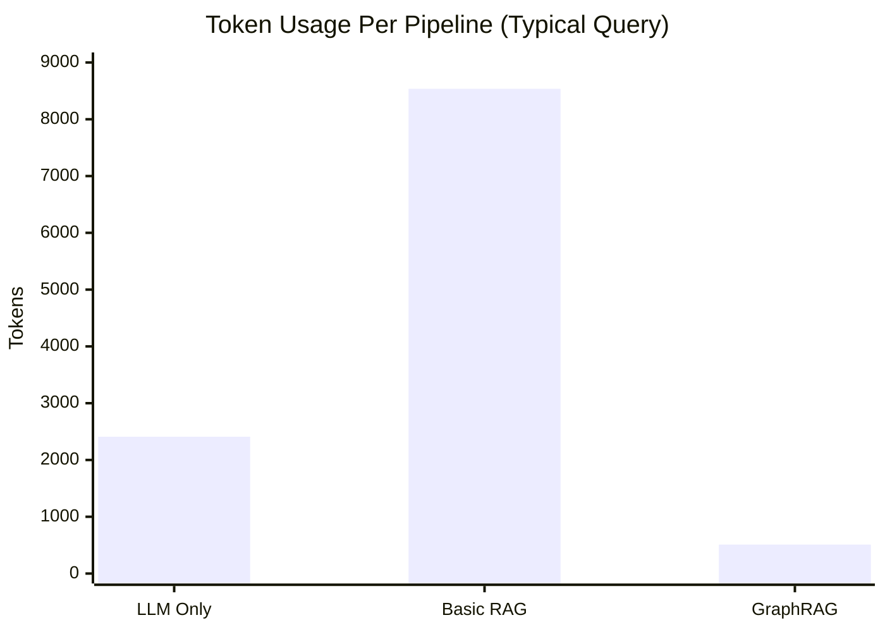

### Token Breakdown

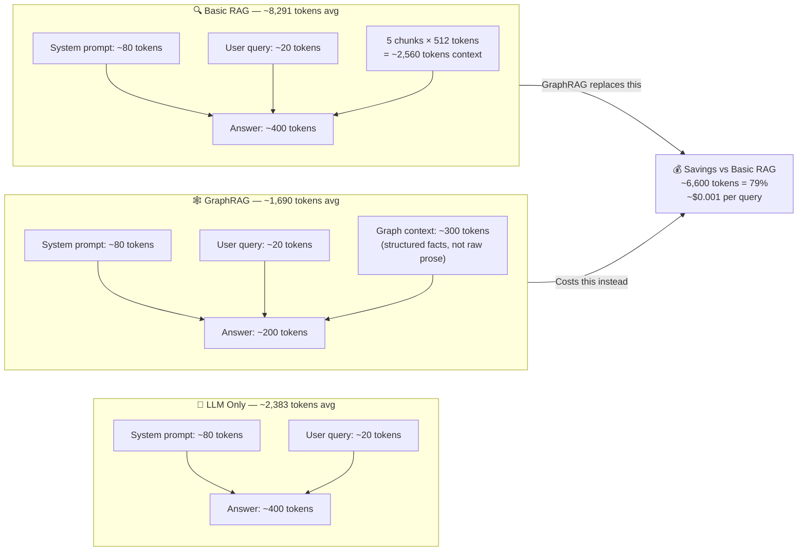

### Cost Model (Gemini 2.5 Flash pricing)

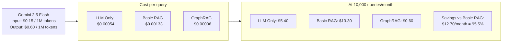

---

## 10. Deployment Architecture

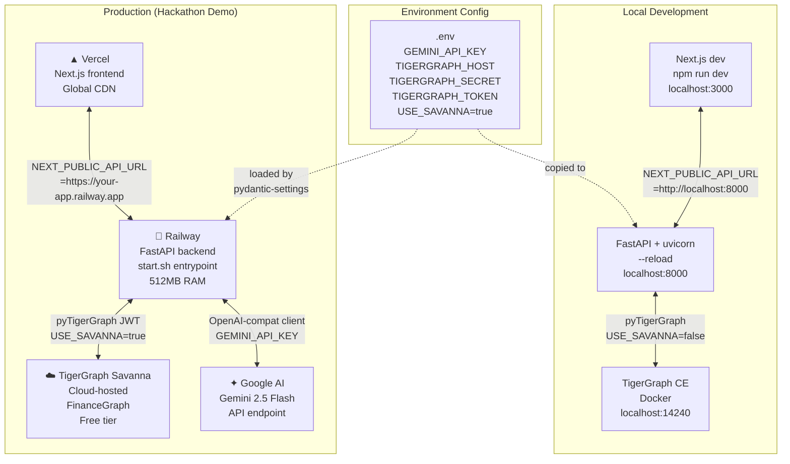

### Railway `railway.toml` Config

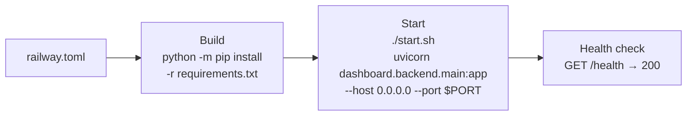

---

## Summary

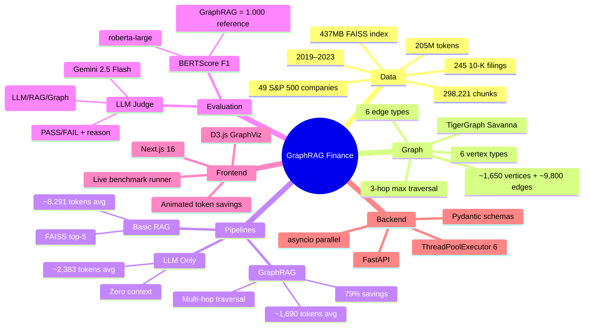
